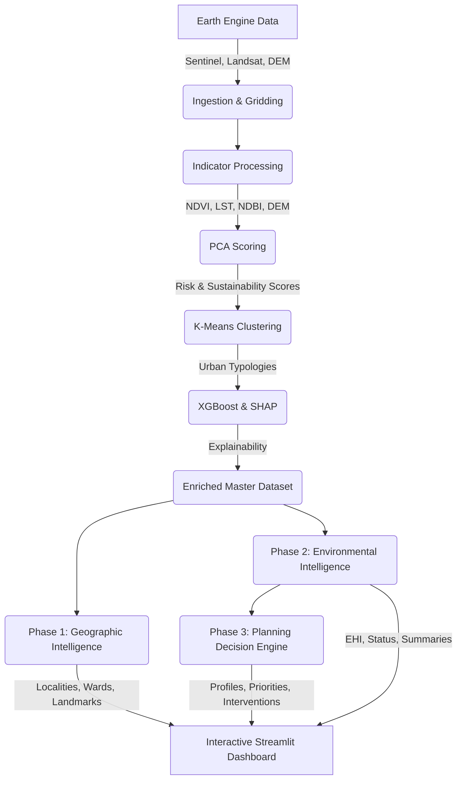
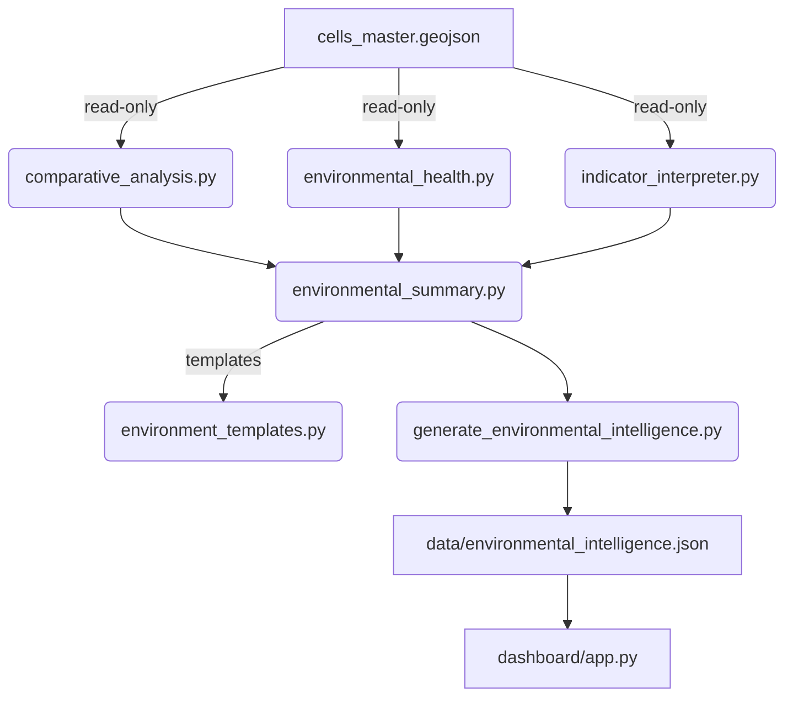
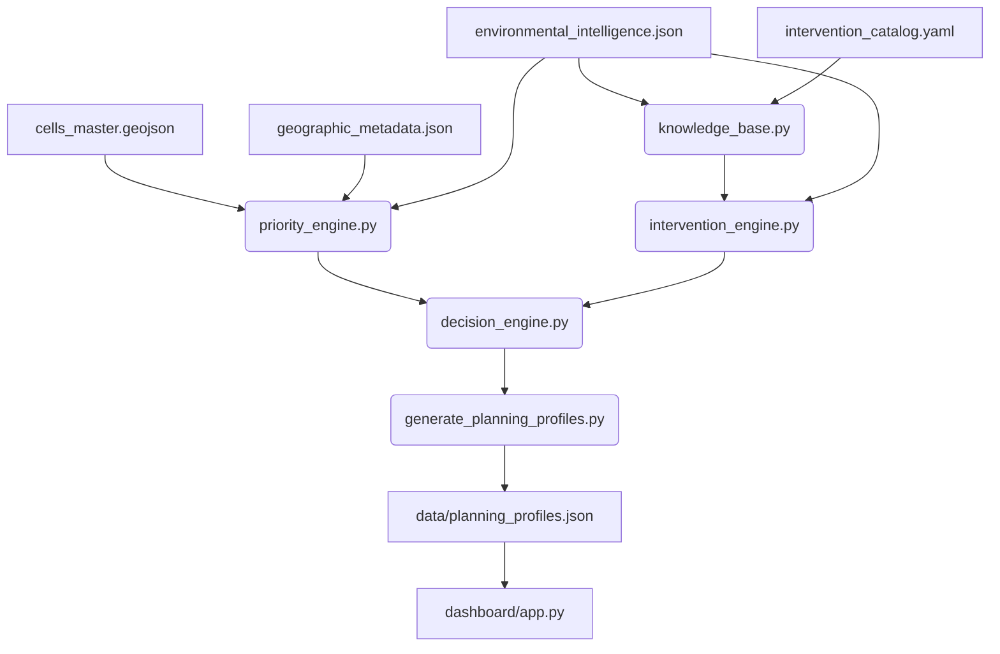

# City Sense

**An AI-driven geospatial pipeline for assessing and explaining urban environmental risks and sustainability.**

## Problem Statement

Rapid urbanization presents critical challenges, including Urban Heat Islands (UHI), loss of green cover, and increased flood risks. City planners and stakeholders often lack accessible, high-resolution, and explainable insights to make data-driven decisions. **City Sense** bridges this gap by fusing Earth observation data (Sentinel-2, Landsat, SRTM) into a unified, grid-based framework, applying machine learning to score environmental risks, cluster similar urban typologies, and explain the key drivers of those risks using SHAP (SHapley Additive exPlanations).

## Architecture & Pipeline



## Phase 2: Environmental Intelligence Layer

The Environmental Intelligence Layer converts raw remote sensing indicators
into human-readable narratives and comparative analytics that city planners
can act on directly — without requiring GIS expertise.

### Design Principle

Every indicator answers **"So what?"**

| Before (Phase 1) | After (Phase 2) |
|---|---|
| NDVI = 0.18 | Vegetation cover is 44% below the city average, indicating poor ecological health and limited cooling capacity. |
| LST = 39.4°C | This grid is among the hottest 6% of locations in Mumbai and exhibits a strong Urban Heat Island effect. |
| Risk = 0.82 | Environmental Health: **19 / 100 — Critical**. Primary issue: Urban Heat Island. |

### Environmental Health Index (EHI)

A composite score (0–100, higher = healthier) computed independently of the
PCA Risk Score using a domain-justified weighted formula:

| Indicator | Weight | Rationale |
|---|---|---|
| LST (surface temperature) | 30% | Primary heat stress driver in Mumbai |
| NDVI (vegetation) | 25% | Key ecological cooling mechanism |
| UHI Intensity | 20% | Urban heat island amplification |
| NDBI (built-up density) | 15% | Impervious surface coverage |
| DEM (elevation) | 10% | Flood susceptibility proxy |

**Formula:**
1. MinMax-normalise each indicator to [0, 1] using city-wide min/max.
2. Invert NDVI and DEM so that `1.0 = highest risk` for all indicators.
3. Weighted sum → composite ∈ [0, 1].
4. `EHI = (1 − composite) × 100`, clamped to [0, 100].

**Status labels:** Critical (0–19) · Poor (20–39) · Moderate (40–59) · Good (60–79) · Excellent (80–100)

### Comparative Analytics

For every cell, each indicator is compared against city-wide statistics:
- Absolute deviation from city mean (e.g. `+4.3°C`)
- Percentage deviation (e.g. `12% above city average`)
- Percentile rank (e.g. `93rd percentile — hotter than 93% of all grids`)

### Detected Environmental Conditions

The layer automatically detects six named conditions using percentile-rank
thresholds (no ML model required):

| Condition | Trigger criteria |
|---|---|
| Urban Heat Island | UHI rank ≥ 75th AND LST rank ≥ 70th percentile |
| Low Vegetation | NDVI rank ≤ 25th percentile |
| High Built-up Density | NDBI rank ≥ 75th percentile |
| Flood Susceptibility | DEM rank ≤ 20th percentile |
| Environmental Stress | EHI < 40 |
| Ecological Stability | EHI ≥ 70 AND NDVI rank ≥ 60th percentile |

### Architecture



### Module Reference

| Module | Responsibility |
|---|---|
| `environment_templates.py` | All constants: EHI weights, status thresholds, condition rules, summary templates |
| `comparative_analysis.py` | City-wide statistics; per-cell percentile ranks and deviations |
| `environmental_health.py` | EHI computation (single-cell and vectorised batch); status label |
| `indicator_interpreter.py` | Condition detection; spatial context sentence generation |
| `environmental_summary.py` | Template-based narrative paragraph (no LLM) |
| `generate_environmental_intelligence.py` | Pipeline stage orchestrator; writes JSON output |

### Output Data Model

Each cell in `data/environmental_intelligence.json` contains:

```json
{
  "environmental_health": 71.4,
  "environmental_status": "Moderate",
  "city_rank_lst": 93.0,
  "city_rank_ndvi": 18.0,
  "city_rank_ndbi": 78.0,
  "city_rank_uhi": 88.0,
  "city_rank_dem": 22.0,
  "city_rank_risk": 85.0,
  "mean_lst_vs_city_avg": 4.3,
  "mean_ndvi_vs_city_avg": -0.15,
  "mean_ndvi_pct_diff": -44.0,
  "detected_conditions": ["Urban Heat Island", "Low Vegetation"],
  "primary_issue": "Urban Heat Island",
  "secondary_issue": "Low Vegetation",
  "spatial_context": "This grid is hotter than 93% of all Mumbai grids ...",
  "environmental_summary": "This grid experiences elevated surface temperatures ..."
}
```

### Dashboard Sidebar Layout (Phase 2)

```
📍 Geographic Profile
↓
🌿 Environmental Health   ← EHI score + status badge
↓
🔥 Environmental Issues   ← detected conditions
↓
📈 Comparative Analysis   ← per-indicator rank + delta vs city avg
↓
🧠 Environmental Summary  ← template-based paragraph
↓
📊 Spatial Context        ← spatial ranking sentence
↓
📋 Raw Indicators         ← collapsed expander
↓
🧠 AI Explanation         ← SHAP explanation (unchanged)
↓
🚨 Planning Priority      ← Phase 3 (see below)
```

## Phase 3: Urban Planning Intelligence & Decision Engine

Phase 3 transforms environmental evidence into actionable planning decisions.
Where Phase 2 answered *"What conditions exist?"*, Phase 3 answers
*"What should the city do, how urgent is it, and why?"*

### Design Philosophy

Every environmental issue produces a complete planning response:

```
Environmental Condition
    → Planning Objective
    → Recommended Intervention (primary + secondary)
    → Expected Benefits
    → Implementation Cost / Timeline / Complexity
    → Priority Score
    → Explainable Evidence
```

All reasoning is **deterministic and reproducible** — no LLM required.

### YAML-Driven Knowledge Base

All recommendation logic lives in `planning/intervention_catalog.yaml`.
**No source-code changes are needed to add or modify interventions.**

To add a new intervention:
1. Open `planning/intervention_catalog.yaml`.
2. Add a new key under `interventions:` matching the condition name exactly.
3. Provide `primary`, `secondary`, `objectives`, `benefits`, `cost`, `timeline`, `complexity`.
4. Optionally add a multi-condition override under `multi_condition_overrides:`.

Example:
```yaml
interventions:
  My New Condition:
    primary: "My Intervention"
    secondary: ["Supporting Action 1", "Supporting Action 2"]
    objectives: ["My Planning Goal"]
    benefits: ["Benefit A", "Benefit B"]
    cost: "Medium"
    timeline: "2-4 Years"
    complexity: "Moderate"
    priority_weight: "High"
```

### Priority Score Formula

| Component | Weight | Source |
|---|---|---|
| EHI deficit `(100 − EHI)` | 35% | Phase 2 environmental_intelligence.json |
| Risk Score | 30% | cells_master.geojson (PCA) |
| Population Score (normalised) | 20% | geographic_metadata.json |
| Strategic Weight (land-use) | 15% | geographic_metadata.json → knowledge_base |

**Priority Labels:** Critical (80–100) · High (60–79) · Medium (40–59) · Low (20–39) · Very Low (0–19)

**Strategic weights by land use:**

| Land Use | Weight |
|---|---|
| Dense Commercial / Industrial | 90 |
| Residential | 80 |
| Mixed Urban | 70 |
| Mixed Residential | 60 |
| Sparse Vegetation / Open Land | 40 |
| Green Space / Forest | 30 |
| Water Body / Coastal | 10 |

### Confidence Score Formula

```
shap_score        = min(|top_positive_shap| / city_max_shap, 1.0)
data_completeness = n_indicators_present / 5
condition_boost   = min(n_conditions × 0.05, 0.15)

confidence = 0.50 × shap_score
           + 0.35 × data_completeness
           + 0.15 × condition_boost
```

### Multi-Indicator Reasoning

The engine evaluates all detected conditions simultaneously.
Multi-condition overrides select the most appropriate intervention
when conditions co-occur:

| Conditions | Selected Intervention |
|---|---|
| UHI + Low Vegetation + High Built-up | Urban Forest (complex) |
| UHI + Low Vegetation | Urban Forest (moderate) |
| UHI + High Built-up | Cool Roof Program |
| Flood + High Built-up | Integrated Drainage & Green Infrastructure |

### Architecture



### Module Reference

| Module | Responsibility |
|---|---|
| `intervention_catalog.yaml` | YAML knowledge base — edit to add interventions, no code changes needed |
| `knowledge_base.py` | Loads catalog; resolves single/multi-condition lookups |
| `priority_engine.py` | Priority Score (0–100) and Priority Label per cell |
| `intervention_engine.py` | Intervention selection; confidence scoring; evidence text |
| `planning_summary.py` | Assembles the final Planning Profile dict |
| `decision_engine.py` | Top-level orchestrator; runs all modules over the dataset |
| `generate_planning_profiles.py` | Pipeline stage; writes `data/planning_profiles.json` |

### Output Data Model

Each cell in `data/planning_profiles.json` contains:

```json
{
  "planning_priority":          "Critical",
  "priority_score":             91.2,
  "primary_objective":          "Reduce Urban Heat",
  "recommended_intervention":   "Urban Forest",
  "secondary_interventions":    ["Cool Roof Program", "Street Tree Plantation"],
  "expected_benefits":          ["Lower LST", "Higher NDVI", "Better Air Quality"],
  "implementation_cost":        "Medium",
  "implementation_timeline":    "2-5 Years",
  "implementation_complexity":  "Moderate",
  "confidence":                 0.883,
  "evidence":                   "This area has been identified as having Urban Heat Island. Surface temperature ranks in the hottest 93% of the city. SHAP analysis identifies surface temperature as the strongest contributor to risk (SHAP value: +4.23). Therefore Urban Forest provides the highest expected environmental benefit for this grid.",
  "environmental_health":       18.5,
  "risk_score":                 88.0
}
```

### Dashboard Sidebar Layout (Phase 3)

```
📍 Geographic Profile
↓
🌿 Environmental Health   ← EHI score + status badge (Phase 2)
↓
🔥 Environmental Issues   ← detected conditions (Phase 2)
↓
📈 Comparative Analysis   ← per-indicator rank + delta (Phase 2)
↓
🧠 Environmental Summary  ← template paragraph (Phase 2)
↓
📋 Raw Indicators         ← collapsed expander
↓
🧠 AI Explanation         ← SHAP explanation (unchanged)
↓
🚨 Planning Priority      ← priority label + score (Phase 3, NEW)
↓
🎯 Planning Objective     ← primary objective (Phase 3, NEW)
↓
🏗️ Recommended Intervention ← primary + secondary list (Phase 3, NEW)
↓
📈 Expected Benefits      ← benefit list (Phase 3, NEW)
↓
💰 Implementation Details ← cost | timeline | complexity (Phase 3, NEW)
↓
🧠 Why this recommendation? ← evidence + confidence (Phase 3, NEW)
```

## Features & Methodology

- **Data Ingestion & Gridding**: Divides the bounding box (Mumbai) into a high-resolution spatial grid and extracts remote sensing data using Google Earth Engine.
- **Indicators**:
  - **NDVI**: Normalized Difference Vegetation Index (green cover).
  - **LST**: Land Surface Temperature (derived from thermal bands).
  - **NDBI**: Normalized Difference Built-up Index (urban density).
  - **DEM**: Digital Elevation Model (flood risk proxy).
  - **UHI Intensity**: Deviation of a cell's temperature from the mean LST of a reference green area (Sanjay Gandhi National Park / Aarey Colony), following standard urban heat island methodology.
- **PCA Scoring**: Uses Principal Component Analysis to compute a composite Risk Score and a Sustainability Score.
- **Clustering**: K-Means clustering groups cells into distinct urban typologies (e.g., "Dense Urban Heat Core", "Vegetated Suburbs").
- **Explainability (SHAP)**: An XGBoost surrogate model predicts the Risk Score, and SHAP values are extracted to explain the primary positive and negative drivers for *every single grid cell*.
- **Geographic Intelligence Layer (Phase 1)**: Transforms raw grid identifiers into meaningful geographic profiles.
  - Reverse geocoding (OpenStreetMap Nominatim) maps cells to localities (e.g., *Powai*).
  - Spatial joins map grids to administrative wards and zones.
  - Overpass API detects nearby landmarks (hospitals, schools, parks).
  - Land use classification categorizes dominant urban footprints.
  - Ward-level census data estimates cell-level population.
- **Environmental Intelligence Layer (Phase 2)**: Converts raw indicators into city-planner-facing narratives without any new ML models.
  - Environmental Health Index (EHI, 0–100) with five status tiers.
  - Comparative analytics: percentile ranks and deviations vs. city average for every indicator.
  - Automatic detection of six named environmental conditions (Urban Heat Island, Low Vegetation, etc.).
  - Deterministic template-based Environmental Summary paragraphs.
  - Spatial context sentences ("hotter than 93% of Mumbai grids").
- **Planning Decision Engine (Phase 3)**: Converts environmental evidence into actionable planning recommendations.
  - YAML-driven intervention knowledge base — add interventions without code changes.
  - Multi-indicator reasoning selects the most appropriate intervention for co-occurring conditions.
  - Priority Score (0–100) combining EHI, risk, population, and strategic land-use weight.
  - Confidence score grounded in SHAP magnitude and data completeness.
  - Explainable evidence paragraph linking every recommendation to indicator ranks and SHAP drivers.
- **Interactive Dashboard**: A Streamlit application featuring Folium maps, Environmental Intelligence panels, and Planning Profile sidebars with full intervention rationale.

## Results & Key Findings

- **LST-NDVI Correlation**: As expected, a strong negative correlation is observed between vegetation density and land surface temperature, validating the UHI effect.
- **Feature Importance**: NDBI (built-up area) and LST are the strongest drivers of high Risk Scores, while NDVI heavily drives Sustainability Scores.
- **Clustering Map**: Distinct patterns emerge across the city, highlighting the dense urban core versus the greener outskirts and coastal boundaries.

## Project Structure

```text
CitySense/city_sense/
├── README.md
├── LICENSE
├── requirements.txt
├── config/
│   ├── config.yaml              # All runtime configuration
│   └── geographic_config.yaml   # Geographic intelligence settings
├── config_loader.py             # Shared YAML configuration loader
├── main.py                      # Single pipeline entry point
├── utils.py                     # Configuration validation & structured logging
├── geo_utils.py                 # Shared geographic utilities
├── ingestion/                   # Scripts to fetch and grid GEE data
├── processing/                  # Scripts to calculate indicators
├── modeling/                    # Scoring, clustering, and SHAP explanations
├── metadata/                    # Phase 1: Geographic Intelligence Layer
├── environment/                 # Phase 2: Environmental Intelligence Layer
│   ├── environment_templates.py     # Constants, thresholds, and templates
│   ├── comparative_analysis.py      # City-wide stats and percentile rankings
│   ├── environmental_health.py      # EHI computation and status labels
│   ├── indicator_interpreter.py     # Condition detection and spatial context
│   ├── environmental_summary.py     # Template-based narrative paragraphs
│   └── generate_environmental_intelligence.py  # Pipeline stage + JSON output
├── planning/                    # Phase 3: Urban Planning Decision Engine
│   ├── intervention_catalog.yaml    # YAML knowledge base (edit to add interventions)
│   ├── knowledge_base.py            # Catalog loading and intervention resolution
│   ├── priority_engine.py           # Priority Score and label computation
│   ├── intervention_engine.py       # Intervention selection and confidence scoring
│   ├── planning_summary.py          # Planning Profile assembly
│   ├── decision_engine.py           # Top-level orchestrator
│   └── generate_planning_profiles.py # Pipeline stage + JSON output
├── dashboard/                   # Streamlit application (app.py)
├── data/                        # Processed GeoJSON, JSON, and imagery
│   ├── geo/                     # Cached geographic metadata and ward boundaries
│   ├── overlays/                # Optional static satellite imagery overlays
│   ├── environmental_intelligence.json  # Phase 2 enrichment output
│   └── planning_profiles.json       # Phase 3 planning decisions output
└── tests/                       # Unit tests for all modules
```

## Setup & Installation

1. **Clone the repository:**
   ```bash
   git clone https://github.com/aryan4-eternity/CitySense
   cd city_sense
   ```

2. **Create and activate a virtual environment:**
   ```bash
   python -m venv venv
   # Windows:
   venv\Scripts\activate
   # macOS/Linux:
   source venv/bin/activate
   ```

3. **Install dependencies:**
   ```bash
   pip install -r requirements.txt
   ```

4. **Earth Engine Authentication:**
   You must have a Google Earth Engine account. Authenticate your environment:
   ```bash
   earthengine authenticate
   ```

5. **Configuration:**
   Update `config/config.yaml` with your preferred city, bounding box, grid
   resolution, date range, model settings, dashboard defaults, and output paths.

## How to Run the Pipeline

The entire pipeline is orchestrated by `main.py`. It validates
`config/config.yaml`, sets up structured logging, and calls the real ingestion
and processing stages in dependency order. Individual stages remain runnable
as Python modules for focused development.

```bash
python main.py
```
Logs will be output to the console and saved to `citysense.log`.

## How to Run the Dashboard

To view the interactive Streamlit dashboard locally:

```bash
python -m streamlit run dashboard/app.py
```
Then navigate to `http://localhost:8501` in your web browser. 

*Optional: Place exported `mumbai_rgb.tif` and `mumbai_thermal.tif` in `data/overlays/` to enable satellite basemap toggles.*

## Validation & Testing

The project includes unit tests to ensure data integrity and model sanity.
To run the tests:

```bash
pytest tests/
```
**Validation Summary:**
- **Silhouette Score:** Evaluates the quality of K-Means clustering.
- **LST Bounds:** Unit tests ensure surface temperatures fall within a plausible range (10°C - 60°C).
- **SHAP Consistency:** Verifies that features like LST positively contribute to Risk, while NDVI negatively contributes.
- **EHI Bounds:** Unit tests verify EHI is always in [0, 100] and that high-stress cells score lower than low-stress cells.
- **Condition Detection:** Deterministic unit tests verify each of the six environmental conditions fires correctly on synthetic data.
- **Summary Templates:** Tests assert that generated summaries never contain unfilled `{placeholder}` tokens across all condition/status combinations.
- **Priority Score Bounds:** Unit tests verify the Priority Score is always in [0, 100] and that high-stress cells rank higher than healthy cells.
- **Intervention Resolution:** Tests verify single-condition lookups, multi-condition override selection (most-specific wins), and default fallback.
- **Confidence Score:** Tests verify the confidence score is clamped to [0, 1] and that high SHAP magnitude with all indicators produces higher confidence than zero SHAP.

## Future Work

- **Phase 4 — Policy Simulator & Budget Optimizer:** Will consume `planning_priority`, `priority_score`, `recommended_intervention`, and `confidence` from `planning_profiles.json` to simulate the impact of green-roof additions or drainage upgrades on predicted risk, and to rank interventions by cost-effectiveness across the city.
- **Temporal Analysis:** Expanding the pipeline to process multiple time windows and assess seasonal changes. The `environment/` modules are designed for future extensibility to time-series inputs.
- **Higher Resolution:** Utilizing commercial satellite data for sub-10m resolution.
- **AI Planning Assistant:** A conversational interface that queries Phase 3 planning profiles to answer natural-language questions like "Which 10 grids should receive funding first?" without recomputation.

## License

This project is licensed under the MIT License - see the [LICENSE](LICENSE) file for details.

## Acknowledgements

- Google Earth Engine for data access.
- The open-source geospatial Python community (GeoPandas, Folium).
- The creators of SHAP for model explainability.
