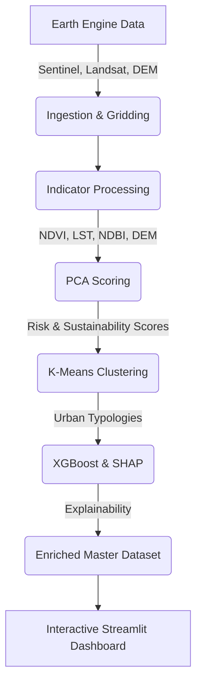

# City Sense

**An AI-driven geospatial pipeline for assessing and explaining urban environmental risks and sustainability.**

## Problem Statement

Rapid urbanization presents critical challenges, including Urban Heat Islands (UHI), loss of green cover, and increased flood risks. City planners and stakeholders often lack accessible, high-resolution, and explainable insights to make data-driven decisions. **City Sense** bridges this gap by fusing Earth observation data (Sentinel-2, Landsat, SRTM) into a unified, grid-based framework, applying machine learning to score environmental risks, cluster similar urban typologies, and explain the key drivers of those risks using SHAP (SHapley Additive exPlanations).

## Architecture & Pipeline



## Features & Methodology

- **Data Ingestion & Gridding**: Divides the bounding box (Mumbai) into a high-resolution spatial grid and extracts remote sensing data using Google Earth Engine.
- **Indicators**:
  - **NDVI**: Normalized Difference Vegetation Index (green cover).
  - **LST**: Land Surface Temperature (derived from thermal bands).
  - **NDBI**: Normalized Difference Built-up Index (urban density).
  - **DEM**: Digital Elevation Model (flood risk proxy).
  - **UHI Intensity**: Deviation of a cell's temperature from the mean LST of a reference green area (Sanjay Gandhi National Park / Aarey Colony), following standard urban heat island methodology.
- **PCA Scoring**: Uses Principal Component Analysis to compute a composite Risk Score and a Sustainability Score.
- **Clustering**: K-Means clustering groups cells into distinct urban typologies (e.g., "Dense Urban Heat Core", "Vegetated Suburbs").
- **Explainability (SHAP)**: An XGBoost surrogate model predicts the Risk Score, and SHAP values are extracted to explain the primary positive and negative drivers for *every single grid cell*.
- **Interactive Dashboard**: A Streamlit application featuring Folium maps for visualizing layers, clicking on cells for detailed breakdowns, and generating rule-based recommendations.

## Results & Key Findings

- **LST-NDVI Correlation**: As expected, a strong negative correlation is observed between vegetation density and land surface temperature, validating the UHI effect.
- **Feature Importance**: NDBI (built-up area) and LST are the strongest drivers of high Risk Scores, while NDVI heavily drives Sustainability Scores.
- **Clustering Map**: Distinct patterns emerge across the city, highlighting the dense urban core versus the greener outskirts and coastal boundaries.

## Project Structure

```text
CitySense/city_sense/
├── README.md
├── LICENSE
├── requirements.txt
├── config/
│   └── config.yaml          # All runtime configuration
├── config_loader.py         # Shared YAML configuration loader
├── main.py                  # Single pipeline entry point
├── utils.py                 # Configuration validation & structured logging
├── ingestion/               # Scripts to fetch and grid GEE data
├── processing/              # Scripts to calculate indicators
├── modeling/                # Scoring, clustering, and SHAP explanations
├── dashboard/               # Streamlit application (app.py)
├── data/                    # Processed GeoJSON, JSON, and imagery
│   └── overlays/            # Optional static satellite imagery overlays
└── tests/                   # Unit tests for scoring and indicators
```

## Setup & Installation

1. **Clone the repository:**
   ```bash
   git clone https://github.com/aryan4-eternity/CitySense
   cd city_sense
   ```

2. **Create and activate a virtual environment:**
   ```bash
   python -m venv venv
   # Windows:
   venv\Scripts\activate
   # macOS/Linux:
   source venv/bin/activate
   ```

3. **Install dependencies:**
   ```bash
   pip install -r requirements.txt
   ```

4. **Earth Engine Authentication:**
   You must have a Google Earth Engine account. Authenticate your environment:
   ```bash
   earthengine authenticate
   ```

5. **Configuration:**
   Update `config/config.yaml` with your preferred city, bounding box, grid
   resolution, date range, model settings, dashboard defaults, and output paths.

## How to Run the Pipeline

The entire pipeline is orchestrated by `main.py`. It validates
`config/config.yaml`, sets up structured logging, and calls the real ingestion
and processing stages in dependency order. Individual stages remain runnable
as Python modules for focused development.

```bash
python main.py
```
Logs will be output to the console and saved to `citysense.log`.

## How to Run the Dashboard

To view the interactive Streamlit dashboard locally:

```bash
python -m streamlit run dashboard/app.py
```
Then navigate to `http://localhost:8501` in your web browser. 

*Optional: Place exported `mumbai_rgb.tif` and `mumbai_thermal.tif` in `data/overlays/` to enable satellite basemap toggles.*

## Validation & Testing

The project includes unit tests to ensure data integrity and model sanity.
To run the tests:

```bash
pytest tests/
```
**Validation Summary:**
- **Silhouette Score:** Evaluates the quality of K-Means clustering.
- **LST Bounds:** Unit tests ensure surface temperatures fall within a plausible range (10°C - 60°C).
- **SHAP Consistency:** Verifies that features like LST positively contribute to Risk, while NDVI negatively contributes.

## Future Work

- **Temporal Analysis:** Expanding the pipeline to process multiple time windows and assess seasonal changes.
- **Higher Resolution:** Utilizing commercial satellite data for sub-10m resolution.
- **Policy Simulator:** Adding a feature to the dashboard allowing users to "simulate" adding green roofs to a cell and observing the predicted risk reduction.

## License

This project is licensed under the MIT License - see the [LICENSE](LICENSE) file for details.

## Acknowledgements

- Google Earth Engine for data access.
- The open-source geospatial Python community (GeoPandas, Folium).
- The creators of SHAP for model explainability.
