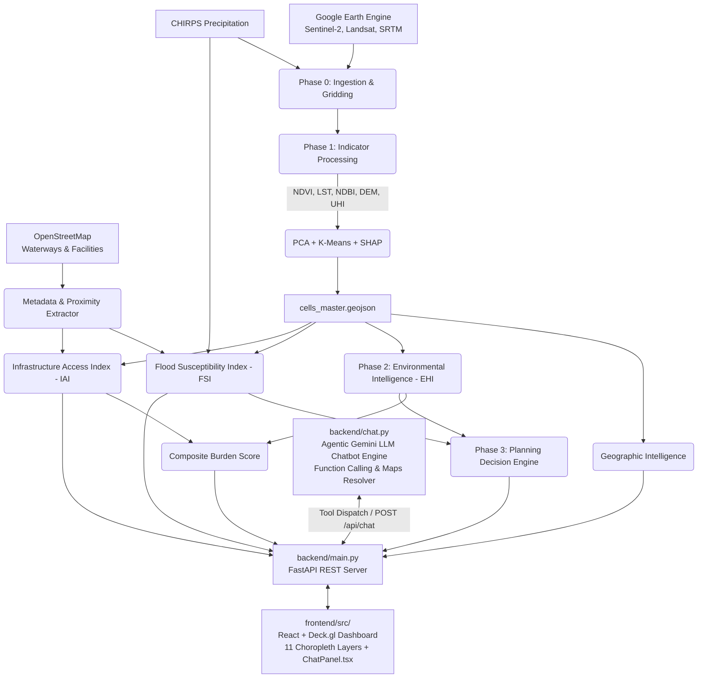

# CitySense

**AI-Powered Urban Planning Decision Support System for Mumbai**

CitySense fuses satellite Earth observation, OpenStreetMap infrastructure data, and deterministic analytics into a city-wide environmental intelligence platform — helping urban planners move from raw indicators to actionable, explainable recommendations at 1 km² resolution across 1,663 grid cells covering the Mumbai Metropolitan Region (MMR): Mumbai, Navi Mumbai, Thane, Kalyan-Dombivli and beyond.

---

## What CitySense Does

| Question | What CitySense produces |
|---|---|
| Where is this place? | Geographic profile: locality, ward, zone, landmarks, population |
| What environmental conditions exist? | Environmental Health Index (EHI), 6 detected conditions, city-wide percentile ranks |
| How flood-prone is this area? | Flood Susceptibility Index (FSI): elevation, drainage proximity, rainfall |
| How well-served is this area? | Infrastructure Access Index (IAI): hospitals, schools, parks, transit |
| What should be done, and how urgently? | Planning priority score, intervention recommendation, cost/timeline, evidence |
| Which areas face both environmental burden and access gaps? | Composite Burden Score (EHI deficit + IAI deficit) |

---

## Full Pipeline Architecture


```mermaid
graph TD
    GEE[Google Earth Engine<br>Sentinel-2, Landsat, SRTM] --> ING(Phase 0: Ingestion & Gridding)
    CHIRPS[CHIRPS Precipitation] --> ING
    OSM[OpenStreetMap<br>Waterways & Facilities] --> META(Metadata & Proximity Extractor)
    
    ING --> PROC(Phase 1: Indicator Processing)
    PROC -->|NDVI, LST, NDBI, DEM, UHI| ML(PCA + K-Means + SHAP)
    ML --> MASTER[cells_master.geojson]
    
    MASTER --> P1(Geographic Intelligence)
    MASTER --> P2(Phase 2: Environmental Intelligence - EHI)
    
    MASTER & CHIRPS & META --> FSI(Flood Susceptibility Index - FSI)
    MASTER & META --> IAI(Infrastructure Access Index - IAI)
    
    P2 & IAI --> CB(Composite Burden Score)
    P2 & FSI --> P3(Phase 3: Planning Decision Engine)
    
    P3 & CB & FSI & IAI & P1 --> API[backend/main.py<br>FastAPI REST Server]
    
    CHAT[backend/chat.py<br>Agentic Gemini LLM Chatbot Engine<br>Function Calling & Maps Resolver] <-->|Tool Dispatch / POST /api/chat| API
    
    API <--> DASH[frontend/src/<br>React + Deck.gl Dashboard<br>11 Choropleth Layers + ChatPanel.tsx]
```

---

## Project Structure

```
city_sense/
├── main.py                          # Single pipeline entry point
├── config/
│   ├── config.yaml                  # All runtime configuration
│   └── geographic_config.yaml       # Ward populations, land-use thresholds
├── ingestion/                       # GEE data fetching
│   ├── generate_grid.py             # 1 km² fishnet grid (from config AOI)
│   ├── fetch_ndvi.py                # Sentinel-2 NDVI (pre-monsoon)
│   ├── fetch_lst.py                 # Landsat LST with emissivity correction
│   ├── fetch_ndbi.py                # Sentinel-2 Built-up Index
│   ├── fetch_dem.py                 # SRTM Elevation
│   └── fetch_precipitation.py       # CHIRPS monsoon rainfall (Jun–Sep)
├── processing/                      # Indicator processing
│   ├── merge_indicators.py
│   ├── compute_uhi.py               # UHI relative to SGNP baseline
│   ├── pca_scoring.py               # Risk + Sustainability scores
│   ├── kmeans_clustering.py         # Urban typology clustering
│   ├── train_explainability.py      # RF surrogate + SHAP attribution
│   └── generate_explanations_json.py
├── metadata/                        # Geographic enrichment
│   ├── geo_enrichment.py            # Nominatim + Overpass + ward join
│   ├── drainage_proxy.py            # OSM waterway distances per cell
│   └── infrastructure_access.py    # OSM hospital/school/park/transit distances
├── environment/                     # Environmental intelligence
│   ├── benchmarks.py                # Green-urban benchmark selection & anchors
│   ├── environment_templates.py     # EHI weights, thresholds, templates
│   ├── comparative_analysis.py      # City-wide stats and percentile ranks
│   ├── environmental_health.py      # EHI (0–100)
│   ├── indicator_interpreter.py     # Condition detection + spatial context
│   ├── environmental_summary.py     # Template-based narratives
│   ├── generate_environmental_intelligence.py
│   ├── flood_susceptibility.py      # FSI (0–100)
│   ├── generate_flood_susceptibility.py
│   ├── infrastructure_access_index.py  # IAI (0–100)
│   ├── generate_infrastructure_access.py
│   └── composite_burden.py          # Burden score (EHI deficit + IAI deficit)
├── planning/                        # Planning decision engine
│   ├── intervention_catalog.yaml    # YAML knowledge base
│   ├── knowledge_base.py
│   ├── priority_engine.py
│   ├── intervention_engine.py
│   ├── planning_summary.py
│   ├── decision_engine.py
│   └── generate_planning_profiles.py
├── backend/
│   ├── main.py                      # FastAPI REST server (6 REST endpoints)
│   └── chat.py                      # OpenRouter/Gemini LLM Chatbot Engine with tool calling
├── frontend/                        # React + Deck.gl dashboard
│   └── src/
│       ├── components/Map/          # WebGL choropleth + hotspot layers
│       ├── components/StatsPanel/   # City-wide stats panel
│       ├── components/CellPanel/    # Cell detail (3 tabs)
│       └── components/LayerBar/     # Layer switcher
├── validation/
│   ├── ground_truth_locations.csv   # 25 Mumbai flood spots
│   ├── ground_truth_check.py        # Flood spatial validation
│   ├── health_ground_truth_check.py # Disease co-location check
│   └── statistical_validation.py   # AUC/AP for FSI vs risk_score vs DEM
├── data/                            # Pipeline outputs
├── models/                          # Trained model .pkl files
└── tests/                           # 93 unit tests
```

---

## Indices and Scores

| Score | Range | Higher = | Key inputs |
|---|---|---|---|
| `risk_score` | 0–100 | More environmental risk | LST, NDVI, NDBI, DEM (PCA) |
| `sustainability_score` | 0–100 | More sustainable | 100 − risk_score |
| `environmental_health` (EHI) | 0–100 | Healthier environment | Green-urban benchmark normalized: LST 30%, NDVI 25%, UHI 20%, NDBI 15%, DEM 10% |
| `flood_susceptibility_score` (FSI) | 0–100 | More flood-prone | DEM 30%, Rainfall 30%, Drain distance 25%, NDBI 15% |
| `iai_score` (IAI) | 0–100 | Better infrastructure access | Hospital, school, park, transit distances + population |
| `burden_score` | 0–100 | Greater combined burden | 50% EHI deficit + 50% IAI deficit |
| `priority_score` | 0–100 | Higher planning urgency | EHI 35%, risk 30%, population 20%, land-use 15% |

---

## Map Layers (Dashboard)

| Layer | Colour scale | What it shows |
|---|---|---|
| Environmental Health (EHI) | Green → Red | Heat/ecology composite health |
| Risk Score | Red → Green | PCA composite risk |
| LST | Blue → Red | Land surface temperature |
| NDVI | Brown → Green | Vegetation cover |
| NDBI | Green → Purple | Built-up density |
| UHI Intensity | Blue → Orange | Urban heat island vs SGNP baseline |
| Planning Priority | Green → Red | Intervention urgency |
| Flood Susceptibility | Blue → Red | Flood-prone areas |
| Access (IAI) | Red → Green | Infrastructure proximity |
| Burden | Green → Red | Environmental + access combined burden |
| Clusters | Categorical | Urban typology (4 classes) |

---

## Setup

### Prerequisites

- Python 3.10+
- Node.js v18+ (tested on v24)
- Google Earth Engine account

### Install

```bash
git clone https://github.com/aryan4-eternity/CitySense
cd city_sense

# Python dependencies
pip install -r requirements.txt

# Frontend dependencies
cd frontend && npm install && cd ..

# GEE authentication (first time only)
earthengine authenticate
```

---

## Running the Dashboard

```bash
# Terminal 1 — Backend API (port 8000)
uvicorn backend.main:app --reload --port 8000

# Terminal 2 — Frontend dev server (port 5173)
cd frontend && npm run dev
```

Open **http://localhost:5173**

---

## Running the Full Pipeline (Fresh Data)

Run these commands in order. Steps marked **[slow]** make external API calls.

### Stage 0 — Grid generation

```bash
python -m ingestion.generate_grid
```

### Stage 1 — GEE satellite data [slow — requires GEE auth]

```bash
python -m ingestion.fetch_ndvi
python -m ingestion.fetch_lst
python -m ingestion.fetch_ndbi
python -m ingestion.fetch_dem
python -m ingestion.fetch_precipitation    # CHIRPS monsoon Jun-Sep
```

### Stage 2 — Core processing

```bash
python -m processing.merge_indicators
python -m processing.compute_uhi
python -m processing.lst_ndvi_analysis
python -m processing.pca_scoring
python -m processing.kmeans_clustering
python -m processing.train_explainability
python -m processing.generate_explanations_json
```

### Stage 3 — Environmental intelligence (Phase 2)

```bash
python -m environment.generate_environmental_intelligence
```

### Stage 4 — Flood Susceptibility Index

```bash
# Drainage proxy via Overpass API [slow — ~15 min for the full grid]
python -m metadata.drainage_proxy

# FSI composite (runs immediately from existing data)
python -m environment.generate_flood_susceptibility
```

### Stage 5 — Infrastructure Access Index

```bash
# Facility distances via Overpass API [slow — ~30-45 min for the full grid × 4 queries]
python -m metadata.infrastructure_access

# IAI composite (runs immediately)
python -m environment.generate_infrastructure_access

# Composite burden (instant)
python -m environment.composite_burden
```

### Stage 6 — Planning profiles (Phase 3)

```bash
python -m planning.generate_planning_profiles
```

### Stage 7 — Geographic enrichment [slow — Nominatim rate-limited]

```bash
python -m metadata.geo_enrichment
```

### Stage 8 — Ward aggregation

```bash
python -m metadata.ward_aggregation
```

### Stage 9 — Validation

```bash
python validation/ground_truth_check.py
python validation/health_ground_truth_check.py
python validation/statistical_validation.py
```

### Run everything at once (uses output-caching — skips completed stages)

```bash
python main.py
```

---

## API Endpoints

| Endpoint | Description |
|---|---|
| `GET /api/cells` | Full GeoJSON with all 11 layer properties |
| `GET /api/cell/{cell_id}` | Complete bundle: master + EHI + planning + FSI + IAI + burden + SHAP |
| `GET /api/stats` | City-wide aggregates (avg EHI, priority distribution, top issues) |
| `GET /api/rankings` | All cells sorted by priority score |
| `GET /api/wards` | 25 ward-level aggregated profiles |
| `GET /api/wards/{ward_name}` | Single ward profile |
| `GET /health` | Health check |

---

## Validation

```bash
pytest tests/ -v          # 93 unit tests
```

| Test file | Coverage |
|---|---|
| `test_environmental_intelligence.py` | EHI, benchmarks, conditions, summaries (42 tests) |
| `test_planning_engine.py` | Priority, interventions, confidence (35 tests) |
| `test_scoring.py` | PCA bounds, correlation, clusters (3 tests) |
| `test_indicators.py` | LST/NDVI/DEM ranges (3 tests) |
| `test_geographic.py` | Ward detector, land use, population (4 tests) |

Ground-truth validation against 25 documented Mumbai flood locations:
- DEM check: 0/25 in bottom-quartile elevation (Mumbai floods are drainage-driven, not elevation-driven — expected result)
- Risk score check: 10/25 (40%) in top-quartile risk; flood-spot average risk 78.0 vs city mean 51.8

---

## Key Findings (Mumbai, Pre-Monsoon 2023)

| Metric | Value |
|---|---|
| Grid cells | 1,663 (0.01° ≈ 1 km² each, full MMR) |
| Avg EHI | 47.5 / 100 |
| Urban Heat Island cells | 416 (25.0%) |
| Low Vegetation cells | 406 (24.4%) |
| High + Critical planning priority cells | 471 (28.3%) |
| Top recommended intervention | Drainage Infrastructure Upgrade (1,008 cells, FSI-injected) |
| Highest-burden ward | L Ward / K-East Ward (avg priority ~55–56) |

---

## Limitations

See `CITYSENSE_TECHNICAL_DOCUMENTATION.md` §15–18 for the full limitations statement. Key points:

- **Single time window:** All satellite imagery is pre-monsoon 2023. Temporal stability is unverified.
- **No independent ground truth for EHI/risk:** SHAP values decompose the composite index, not independently-observed risk outcomes.
- **FSI is a proxy:** Does not model actual drainage capacity, runoff dynamics, or inundation depth.
- **IAI measures proximity, not accessibility:** Straight-line distance to facilities, not walking time, cost, or availability.
- **OSM completeness varies:** Drainage and facility data depends on OSM contributor coverage in each area.

---

## Adding a New Intervention

Edit `planning/intervention_catalog.yaml` only — no code changes needed:

```yaml
interventions:
  My New Condition:
    primary: "My Intervention"
    secondary: ["Support A", "Support B"]
    objectives: ["Planning Goal"]
    benefits: ["Benefit A", "Benefit B"]
    cost: "Medium"
    timeline: "2-4 Years"
    complexity: "Moderate"
    priority_weight: "High"
```

Then re-run: `python -m planning.generate_planning_profiles`

---

## License

MIT License — see [LICENSE](LICENSE)

## Acknowledgements

- Google Earth Engine for satellite data access
- UCSB CHG for CHIRPS precipitation data
- OpenStreetMap contributors for infrastructure data
- GeoPandas, Deck.gl, FastAPI, React communities
